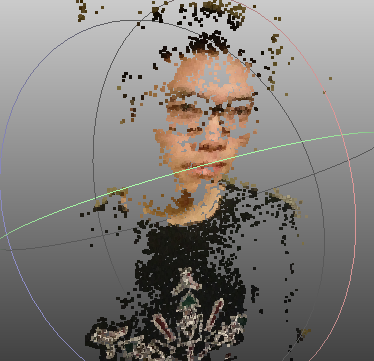

# 2 view structure from motion (From scratch)

### How to run  
1. You can directly go to result folder to see all results  
2. To make it easier to view all results , I selected two images for each imageset. You can reproduce all 3D models using main.m. All 8 pclouds will show up together after program finished. ply will be saved to result folder.  
`main;`    
3. You can specify two images(**intrinsic.new must be in the same folder**):  
` SfM2('imgFolder/img1.JPG','imgFolder/img2.JPG');`  
will not show model after finished, only save .ply to result.  
` SfM2('imgFolder/img1.JPG','imgFolder/img2.JPG',true);`  
will show model after finished, and save .ply to result.  

###### This system has been tested under Matlab 2016a and Ubuntu 16.04. please make sure your matlab have vision toolkit  

### Features  
- dense matching.  
- MSAC instead of RANSAC.  

### main steps of my code
1. get camera intrinsic matrix.  
2. features detection and points matching.  
3. estimate fundamental matrix using feature pairs in two images. Then compute essential matrix using K and F. Decompose E to R and t. Get P using E.  
4. dense matching.  
5. put pairs of points onto 3D(triangulate).  
 
